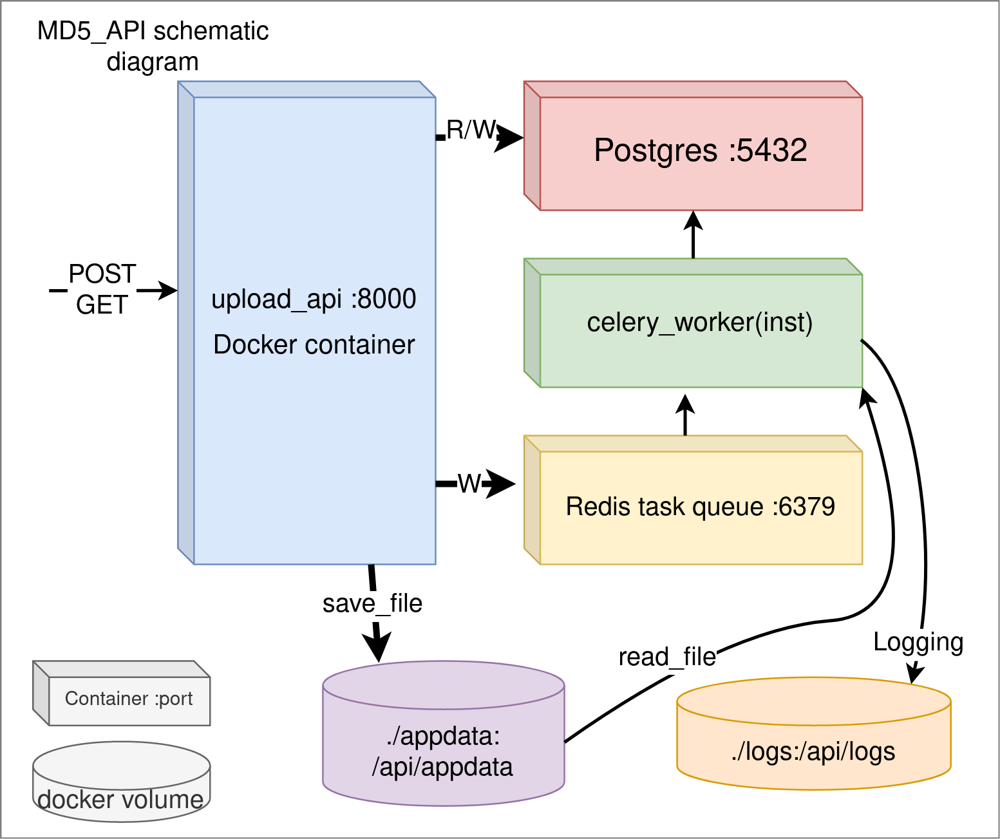
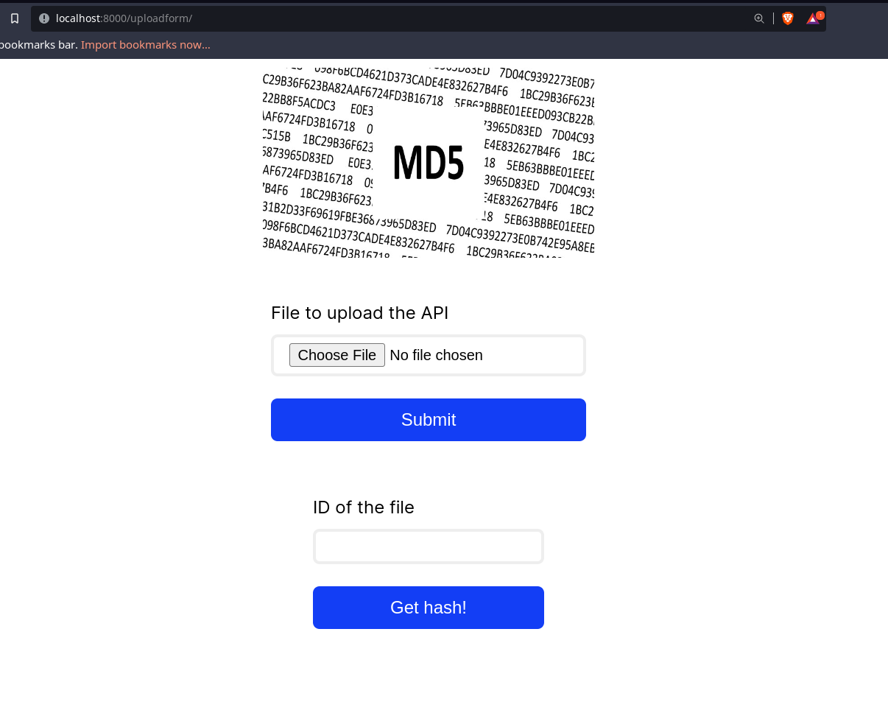

# Overview
This is an API develop as a part of Bostongene onboarding contest. Goal was to create a distributed system to send file to API and get hash calculated on the backend with help of celery.



# Usage (API reference):
For deployment guide, please  check deployment section of this README. Here I describe how to work with installed API. You are free to use API docs `localhost:8000/docs` to check all by yourself in interactive uvicorn page. Or you can use request python scripts to quickly generate the POST requests from `tests/test_requests` folder. Or use them as reference. My text explanation for the protocol is below:
### To send file
Client (browser or another host) can send HTTP post request containing the file under `file` field. In return, he will get JSON in the form of:
`{ "success" : True/False , "id" : id/None, "celery_status" : status/None , "celery_id" : celery_task_id/none }`
None values correspond to `"success" : False` case.

Example of sending file request with `curl` where `FILE` is name of the file:

```
curl -X 'POST' \
  'http://localhost:8000/uploadfile/' \
  -H 'accept: application/json' \
  -H 'Content-Type: multipart/form-data' \
  -F 'file=@FILE;type=image/png'
```
### To get hash
To get hash, you can use `host:8000/get_hash/gethash/?file_id={id}` or send ID as request variable: As JSON  with `{"file_id" : id}` to `host:8000/get_hash/gethash/`. In return, you get JSON in a form of `{ "status" : status(str) , "hash" : hash(str) }`. In case task is not finished, status will be `'PENDING'`. In case of invalid `id` it should be `"status":'INVALID_ID'`.


Example of sending file request with `curl` where `ID` is id which you got before:

```
curl -X 'GET' \
  'http://localhost:8000/gethash/?file_id=ID' \
  -H 'accept: application/json'
```

### Frontend app

To use frontend app go to:

`host:8000/uploadform`. You should be faced with this page where you can upload your file and get ID back. On all pages you also sould be presented with form to request the result from the ID.

### Artifitial delay for testing

For testing features you can add `ARTIFITIAL_DELAY=10` to the `.env` file to add delay to the celery worker.


### Folder structure

    md5_calc_api
    ├── docs                    # Documentation and task files
    ├── src                     # Source files for API and celery workers. 
    ├── docker                  # Docker config files for external pre-build modules (Postgres etc.) 
    ├── tests                   # Automated and not so automated tests
    ├── .github                 # Contains github automation yaml. 
    ├── autoinstall.sh          # Smart deploy script for Linux
    ├── docker-compose.yml      #  Docker compose file for deploying and building containers
    ├── .env                    #  Important file with environmental variables. autoinstall script can generate it.
    ├── env_example             #  This is a template for `.env` file.
    ├── Dockerfile              # Sinle docker file for both API and worker
    ├── requirements.txt        # Requirements for the container to build. Not needed for usage or testing.
    ├── LICENSE
    └── README.md

### Settings

Local settings are modified in `.env` file.  Example is presented in `env_example` file. Some other settings:

`API_PORT=8000` - Default port of API (no default ! )

`CELERY_WORKER_FILESYSTEM_TIMEOUT=10` - This should indicate how long celery worker waits for file (if some glitches in OS appear and file are not there.)

`DELETE_FILE=true/false`  : If true, worker will delete file as soon as hash has been hashed. (default `false`)

`ARTIFITIAL_DELAY` - Indicates if extra delay is added for testing on working payload (Default off)

`CHUNK_SIZE` -  Optionally you can save file in chunkes if RAM is limited. Default off. Example value int value (1024,2048)

# Deployment
## Automated
Use `autoinstall.sh` to generate 2 empty folders (volumes) needed by the system and launch docker compose with newly generated `.env` file. I DO NOT save `.env` file in the git repo to prevent passwords leakage.

## Manual
1. `mkdir appdata` Folder for application to store files.
2. `mkdir logs` Folder for logging. Can be altered in docker-compose.yml.
3. `cp env_example .env` To copy the env variables.
4. `docker-compose up -d --build` to deploy.


## Removing the API

To remove the API use `docker-compose stop && docker-compose rm` command when in the repository folder. This will stop working containers and remove it's internal data. To clean files you can use `rm -r appdata` in the repo folder.

## To add/remove worker

To add or remove worker you can just add new worker container in `docker-compose.yml` file like so:

```
  celery_worker1:
    container_name: celery_worker_1
    build: .
    command: celery -A celery_worker.celery worker --loglevel=info
    restart: always
    volumes:
      - .:/app
      - ./appdata:/api/appdata
      - ./logs:/api/logs
    env_file:
      - .env
    extra_hosts:
      - host.docker.internal:host-gateway
    depends_on:
      - redis
      - postgres
```

## Dependencies
### Linux (any)
Docker (for container managment). You can read about installing docker here: https://docs.docker.com/engine/install/

### Dependencies for testing

python3, pytest, `tests/requirements.txt`.
# Source structure

## src

Main python sources folder. Here are all code including API and celery workers.


    src
    ├── celery_worker.py # Code for celery worker
    ├── database_tools.py # Tools for SQLAlchemy to create and update postgres database
    ├── main_upload_api.py # API code with requests
    ├── settings.py # Code to import `.env` variables. In current configuration contain few user tweaks. Main configuration is in `.env` file.
    └── templates # HTML templates for the application

## tests
Tests folder consists of a set of tests for the API goal. `test_simple.py` provides low load test to ensure code is working correctly. Organized as unit test. However, giving what this API should prove, I created `test_heavy.py` which can heavily load the API and backend with set of randomly generated files with pre known hash and throw them at the server counting time to return query of requests.  Be advised: tests use their own `md5_rest_api/tests/requirements.txt` file for dependencies. 

## doc

Related to task description, pictures, etc

# Testing procedure
Install python3 and test requirements from `tests/requirements.txt`
Run `pytest`, to execute test procedure for the basic flow. 


# Known limitations
* No mechanism to work when parts are distributed behind the proxy server or firewall (mainly to work in local network). Exept database and broker. This can be modified in future.
* No security mechanisms to work in open network. (No authorization mechanism.) :heavy_exclamation_mark:
* File reception of API are limited by filesystem which is common across all containers in current setup.
* Not tested in distributed setup. For example when reddis are in the LAN. But non localhost redis makes this a little bit pointless. :heavy_exclamation_mark:
* IDs are not secure numbers (can be guessed). But can be easily made so by using celery worker ID as ID.
* MD5 is an outdated hasing algorithm but can easily be replaced with any other alternative or any other work function.

# TODO
* [x] CI/CD pipeline in github actions.
* [ ] `logs` Folder for logging. Make that the name and path of the folder can be altered in docker-compose.yml
* [ ] Connection between celery worker results in Postgress and task ID for API database are not related. That can be fixed easily to enable quicker result search time. However, I'm afraid I don't have time to do it right now.
* [x] Proper catch for out of range ID requests
* [ ] Better queries for SQL
* [x] "Pending" status page
* [x] Tests
* [x] Testing procedure description
* [ ] Heavy tests
* [ ] Get request for complete database and stats.
* [ ] Possibly some worker statistics request.

# Other
* Full task by task log of development was also posted in my telegram: https://t.me/ee_craft


